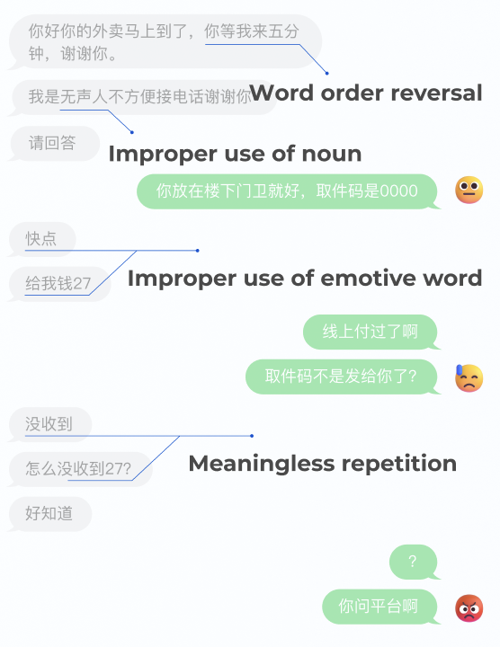

# Datasheet: **Simple Chinese Sign Language for Deaf Food Delivery Riders**

Author: **Zixi Zhou**

## Motivation

1. **For what purpose was the dataset created?** 

	*A chinese influencer shared a chat screen between herself and a hearing-impaired food delivery guy, it looks like the delivery guy's words were so rude. There were many grammatical errors and improper emotive words in this chat, making others feel rude.*

	
	
	*However, after I read the comments I realized that the language logic of hearing-impaired people is different from hearing people, thus it caused misunderstanding. I realize that typing in Chinese Pinyin can be challenging for deaf food delivery riders. I hope to facilitate sign language typing by implementing machine learning-based sign language recognition. Thus, I have created this dataset.*

2. **Who created this dataset (e.g. which team, research group) and on behalf of which entity (e.g. company, institution, organization)?**

	*There is no open-source Chinese sign language dataset available online. Therefore, I have listed three sentences that deaf food delivery riders are most likely to use in their work scenarios: "Hello, your delivery is here"; "Sorry, I will be late"; "Thank you, could you give me a good rating". I self-learned these three sentences in sign language from the internet and simplified them into nine gestures. I personally took pictures of each gesture and created the original dataset.*

3. **What support was needed to make this dataset?** 

	*In fact, Chinese sign language encompasses a wide range of gestures, and due to the particularities of Chinese grammar, collecting more effective data requires the support of professional organizations or specialized linguistic research institutions. My creation is just a demo.*

## Composition

1. **What do the instances that comprise the dataset represent? How many instances are there in total? What data does each instance consist of? Is there a label or target associated with each instance?** 
   
	*The dataset version for training with MediaPipe includes only category names and original images. The dataset version for training with YOLOv5 includes category names, original images, JSON files containing hand coordinate data annotated using LabelMe, and TXT files containing hand coordinate data suitable for YOLOv5 training.*

	*The dataset for training with MediaPipe includes nine types: "arrive", "food", "you", "good", "give", "I", "can", "sorry", and "thanks", with 200 images for each type. The dataset for training with YOLOv5 includes four types: "arrive", "food", "you", and "good", with 15 original images for each type. After augmentation, there are 300 images for each type. The number of annotation files corresponds to these specifications.*

2.  **Does the dataset identify any subpopulations (e.g. by age, gender)? Is it possible to identify individuals (i.e., one or more natural persons), either directly or indirectly (i.e., in combination with other data) from the dataset? Does the dataset contain data that might be considered sensitive in any way?**

	*Since the dataset was collected manually by me and contains my facial and hand information, I do not intend to publicly release it. It is solely for my personal research and learning purposes. Therefore, the dataset does not identify any subpopulations (such as age, gender), nor does it allow for the direct or indirect identification of individuals (i.e., one or more natural persons), or contain data that might be considered sensitive.*

## Collection

1. **How was the data associated with each instance acquired? What mechanisms or procedures were used to collect the data? Who was involved in the data collection process?** 

	*The original image collection is based on my personal photography, with only my personal involvement. For details, please refer to the `00_Collect_images_for_yolo5.py` and `00_Collect_images_for_mediapipe.py` files.*

2. **Over what timeframe was the data collected?** 

	*The latest update to the dataset was made on March 13, 2024.*

3. **Were any ethical review processes conducted? Does the dataset relate to people? Did you collect the data from the individuals? Were the individuals in question notified about the data collection? Did the individuals in question consent to the collection and use of their data? If consent was obtained, were the consenting individuals provided with a mechanism to revoke their consent in the future or for certain uses?** 

	*The dataset originates from me personally. Given that it contains a large amount of my personal information, I do not intend to make it public. Furthermore, the dataset is intended solely for use in projects and learning related to this course.*

## Preprocessing / Cleaning / Labeling

1. **Was any preprocessing/cleaning/labeling of the data done? Was the "raw" data saved in addition to the preprocessed/cleaned/labeled data? Is the software used to preprocess/clean/label the instances available?** 

	*The data was manually cleaned by me, and the categories and hand information were manually annotated for each image using LabelMe. For details, please refer to the file `01_Image_processing_and_data_augmentation.ipynb`*

## Uses / Distribution / Maintenance

   **Collecting this dataset has been an interesting experiment for me. Although I'm currently only using it to train my personal hand recognition model and may not publish or update it in the future, I believe that collecting and creating open-source Chinese hand gesture data is very meaningful. If given the opportunity, I would be very interested in investing in related research.** 

	